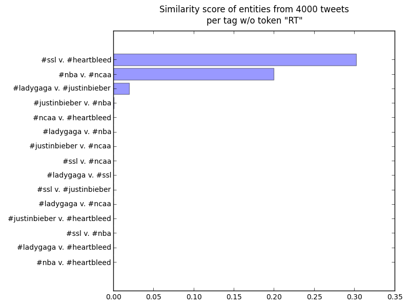
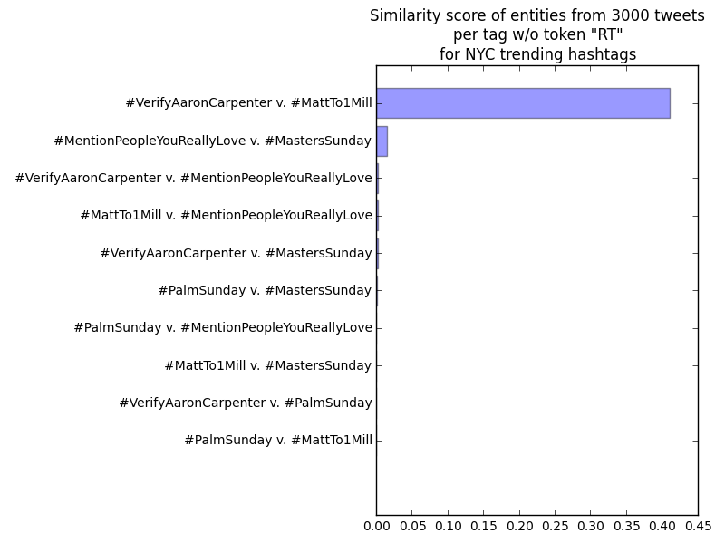
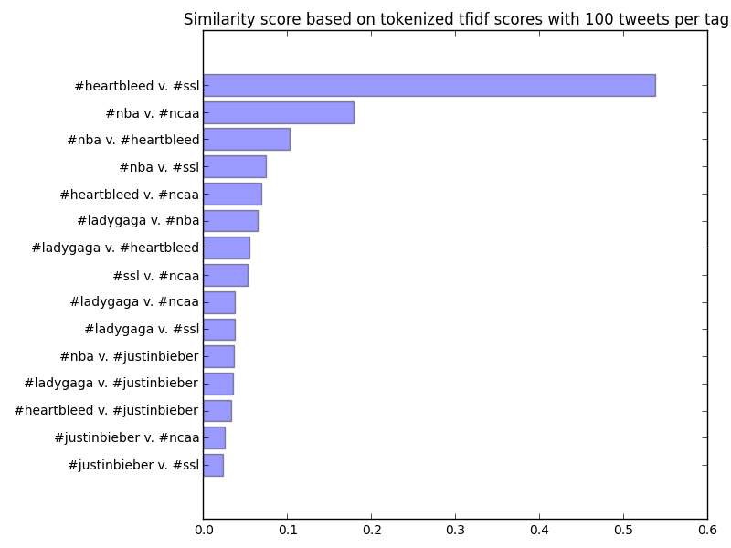
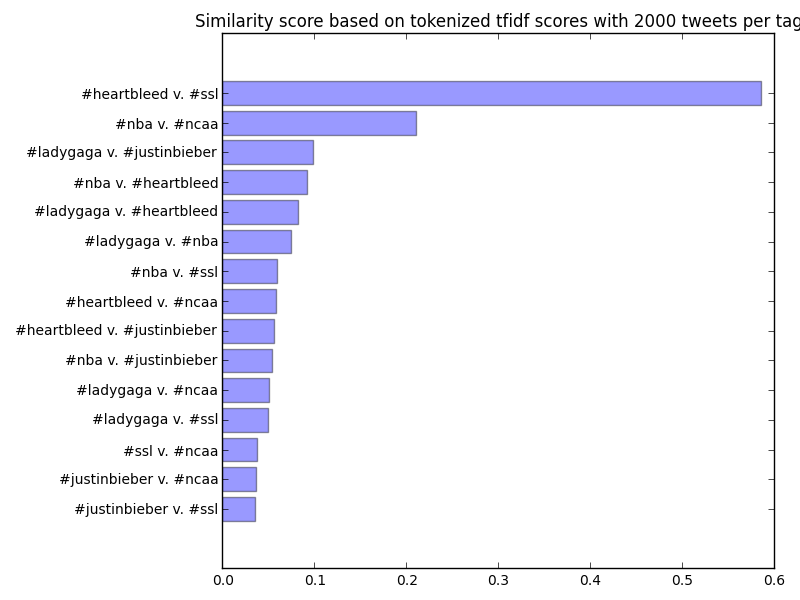
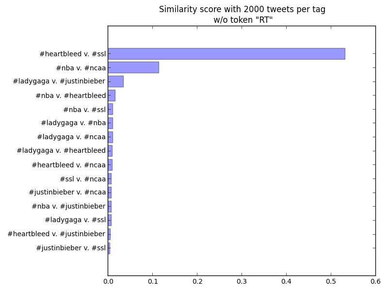
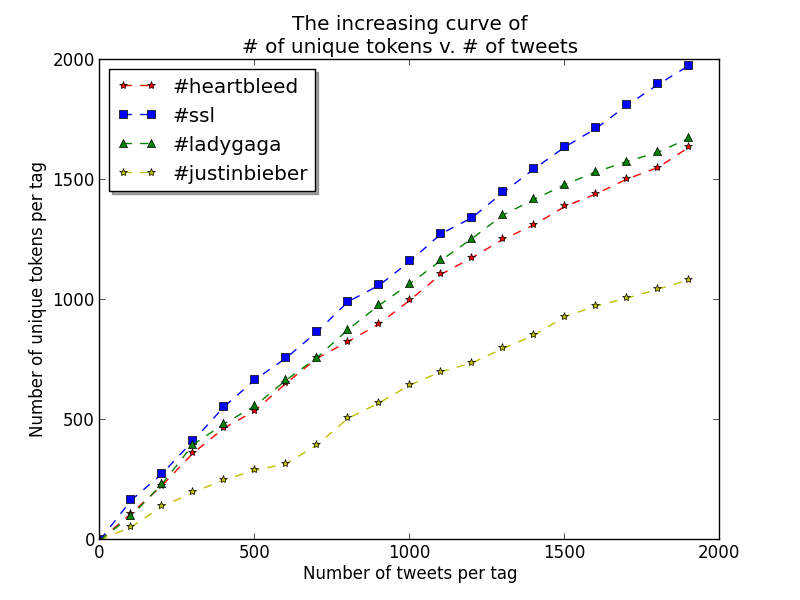
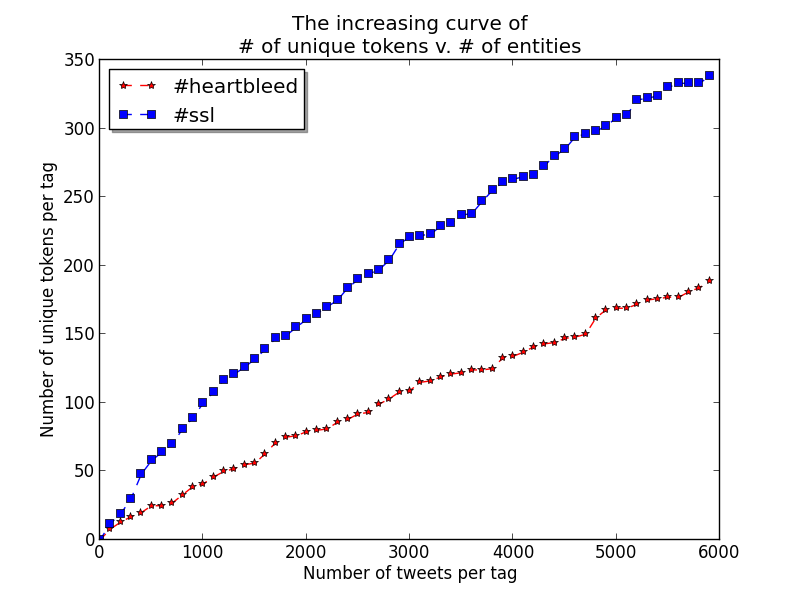

Hashtag similarity calculator
=================

A set of programs to

- given a list of hashtags in a file, or grab tranding hashtags from NYC
- collect tweets associated with each tag
- compute similarity score between any pair of two tags
- plot it out

### Why hashtag?

It is unlike normal document similarity

- hashtags themselves provide little information, one has to find good source of texts to represent them

It is interesting

- to get a sense of similarity ot 2 _objects_ based on what people are talking about them on Twitter
- to identify potential correlations of events happening on the internet
- to discover the pattern of trending hashtags: why could they go viral?

### My algorithm

Disclaimer: I don't have any prior knowledge regarding the algorithms, procedures or tools I used. All stuff freshly baked.

The core of the program is focusing on **2 hashtags**,

- collect entities of tweets associated with 2 hashtags respectively
    - # of tweets per tag = 4000
    - entities being **hashtags** and **mentioned usernames**
- preprocessing:
    - lowercase all characters
    - remove punctuations
    - tokenize
    - remove stopwords (and `rt`!)
- compute TFIDF of each token
- form a vector of TFIDFs for each hashtag
- calculate the cosine similarity of 2 vectors (0,1)

### Result

Hashtags I compared in experiments: 

    #heartbleed
    #ssl
    #nba
    #ncaa
    #ladygaga
    #justinbieber

I have made several plots along the way, but this is the final one,

I also did the same thing for latest trending hashtags in NYC,

**WTF are Matt and Aaron???** Aparently I am not following the trend...

For the performance of my algorithm, there are 2 things,

- I am confident it is able to differentiate _similar hashtag pairs_ and _irrelevant pairs_. You could see from above figures irrelevant pairs hardly get any score.
- As for comparing 2 scores of 2 similar pairs relatively, I would need more expriments to quntify it.

### Some explanation

As I said, unlike normal document similarity computation, in which documents are already given, here we need to find appropriate source to reprensent each hashtag. This also makes the computation interesting; I spend most of my effort on this:

- I firstly start with texts of tweets, instead of entities, for each tag, with the amount of tweets being fixed to 2000. I DID NOT remove links, entities, emojis etc as I suspect they play a role in representing hashtags too
- Then I remove `rt` as a token for every tag because of better accuracy I found in [my experiment](https://github.com/yyl/ComputeSimilarity#0411-530-7pm)
- The choice of 2000 as amount of tweets is arbitrary, therefore I did [some experiments](https://github.com/yyl/ComputeSimilarity#0412-11pm-1230am) attempting to find optimal choice of `n`, that is, the number of tweets after which the accuracy/# of unique tokens start converging. The experiment fails to find convergence within my range.
- Eventually I discovered entities could be a better source for hashtags comparison. The [result](https://github.com/yyl/ComputeSimilarity#0413-330-4pm) speaks itself.

**Things I wish I could do given more time**

- measure the performance of my calculator
- compute similarity scores for more hashtags!
- find the optimal convergent point for the number of tweets processed!
    - I suspect there might not be an optimal point for all tags
    - **optimal amount of tweets should be decided dynamically for each hashtags!**
- are there any other sources have potential of representing hashtags?
- try _N-gram_ as the core metric
- compute similarity score of entities of a hahstag, and **wiki results** of that hashtag!
- how about a fixed corpus as the _oracle_, and instead of comparing tag1 and tag2, we compare tag1 and oracle, and tag2 and oracle
- provide a nicer interface for the program

In conclusion, I learned a lot. I believe I am on the right track, that is using entities to represent hashtags. Entities in tweets are much more correlated to the topic the tweet is talking about. Another thing I believe is to reach a satisfying level of representing a hashtag, there exist a convergent point in the number of required tweets. 

This is truly an interesting area to explore.

### How to use them

dependencies

Could be found in `requirements.txt`

`getContent.py`

Use it to obtain entities/tweets for tags.

    python getContent.py

It will first obtain trending hashtags into local file `trends.txt`. Then it will creates folder `entities` to hold entity file for each tag. Entities of each tag will then be saved in file with the name of that entity in `entities`.

`computeSimilarity.py`

Use it to obtain entities/tweets for tags.

    python computeSimilarity.py foldername

`foldername` means the folder that contains content of hashtags that you wnat to comput similarity scores. Each file in the folder has the name of one tag, and holds either tweets/entities associated with the tag. This folder could be obtained by `getContent.py`.

The program logs pairwise score to the terminal, and saves the barplot into file `hashtag_similarity.png` in current directly.

`chooseN.py`

Use to plot curve of # of tweets v. # of unique tokens. Lots of manual coding. Need to be refactored for use in the future.

***

### Original progress log

A program to compute similarity of two ~~documents~~ hashtags in Twitter

#### TODO

- ~~git repo setup~~ 0408
- ~~some initial research and idea search, decide the topic~~ 0408
- ~~setup working environment~~ 0408
- ~~collect some twitter data~~ 0409
- ~~learn some nltk and scikit-learn basics~~ 0410
- ~~my first similarity calculator?~~ 0410
- ~~get more tweets for each tag~~ 0410
- ~~analyze most common words~~ 0411
- ~~get all entities for each tweet~~ 0411
- ~~compute similarity of 2 hashtags based on only entities in received tweets?~~ 0411
- ~~how is the uniqueness of entities change along the increase of amount of tweets for each tag?~~ 0412
- ~~compare scores based entities and tweets texts~~ 0413
- ~~collect entities of tweets and compute scores for random tags~~ 0413
- for the unstable pair `#ladygaga v. #justinbieber`, compute curve `# of tweets x similarity score`
- test similar hashtags like `#boob` and `#boobs`
- ngrams?

#### 0408 11-12pm

- what is the problem
    - object: document
    - compute similarity of x documents
- what is document similarity?
    - 2 documents have same set of words?
    - 2 documents carry same meaning?
    - document classification?
- what could be document?
    - similarity between 2 linkedIn profiles
    - similarity between a linkedIn profile and a job opening
    - similarity between 2 Twitter hashtags (e.g. comparing tweets containing those 2 tags)

My current take:
How to compute similarity of two Twitter hashtag?

- why  
    - sounds hard: hashtags are short, they contain little information to be compared
    - useful: hashtags are mostly events/entities, by clustering them (hopefully) could eventually bring us some patterns in how events formed in Twitter
        - feel like didnt make this clear enough, need to think about it
- how
    - we could examine tweets containing either hashtag
        - if tweets are similar, it is likely 2 hashtags are similar two (need some validation)
        - let's fix number of tweets to compare to 100 for now
    - other ways?

Tools

- NLTK
- http request lib (for Twitter API)

#### 0409 5-6pm

the program

- take 2 inputs: 2 strings, representing hashtag
- use Twitter search API to obtain first 100 tweets for each hashtag
    - API secrets store separately
    - search only English and medium-level tweets
- do I remove links and names? leave them there for now.

similarity calculator 1

- combine all 100 tweets into a paragraph
- then count frequency of each word?

miscs

- could only compare entities of 2 hashtags

#### 0409 9:30-11pm

- tokenization: split texts on non-alphabetic characters
    - token: a set of consecutive words, unigram, bigram...
    - co-occurent: simple phrases
    - stopwords: useless tokens? such as the, a, are
        - for twitter: rt
- lemmatization: Problem of finding the correct dictionary headword form
    - e.g. plural, past tense
    - stemming: change them back to the core words they are made up, chop down affixes from the stem!
- document frequency
    - salient words: high count in the doc + low count across docs

play nltk

- many hashtags are high frequency words

#### 0410 4-6:30pm, 7:30-9pm, 10-10:30pm

doc similarity

- **salient words**: TF x IDF
- term frequency (TF): `TF(x) = log10(1+c(x)) or c(x)` - high occurrence within doc
- inverse document freq (IDF): `IDF(x) = log10(Ndocs/DF(x))` - low occurrence across docs
- for each doc, `D = [w1, w2, ...]`, where `w` is tfidf score of a token
- cosine similarity: `D1 x D2 / (sqrt(D1^2) x sqrt(D2^2))`

play nltk

- `rt` occurs a lot, and different hashtags have different amount of occurrence of `rt`. itself could be an interesting thing to look at
- is 100 tweets enough for similarity analysis?
- stemming: Porter Stemmer

### first similarity calculator

- given 2 hashtags as input, obtain 100 tweets per tag
- cleaning: lower all characters, remove punctuation, stemming, tokenize
- compute tfidf of 2 docs using scikit-learn
- 6 hashtags are used `#heartbleed #ssl #nba #ncaa #ladygaga #justinbieber`, and I compared each 2 of them

The highest score is `#heartbleed v. #ssl`, 0.538. The second one makes sense too. Then some weird paris such as `#nba v. #ssl` ranked higher than `#ladygaga v. #justinbieber`, which is supposed to be very similar (is that so?). I also computed the same scores for each pair with 2000 tweets per tag.

Apparently I have met the cap of twitter API after pulling several times of 2000 tweets. We could see that the first and second ranking did not change. Now `#ladygaga v. #justinbieber` surpasses all other weird pairs, but it does not differ much from `#nba v. #heartbleed`.

#### 0411 5:30-7pm

As weird result found from my similarity calculator, I first computed the 10 most common tokens of tweets for each hashtag:

       tag name   # of unique tokens 10 most common tokens
       ladygaga                 4713 [('ladygaga', 2189), ('rt', 846), ('gaga', 578), ('ladi', 399), ('roseland', 262), ('artpop', 251), ('guy', 214), ('littlemonst', 206), ('love', 144), ('de', 142)]
            nba                 4653 [('nba', 2080), ('rt', 1102), ('game', 665), ('lebron', 654), ('ha', 610), ('plumle', 595), ('mason', 585), ('break', 569), ('suspend', 568), ('amp', 560)]
     heartbleed                 4595 [('heartble', 2016), ('rt', 1066), ('bug', 380), ('password', 379), ('nsa', 346), ('chang', 299), ('secur', 253), ('year', 239), ('vulner', 203), ('site', 193)]
   justinbieber                 4299 [('justinbieb', 2184), ('rt', 491), ('belieb', 489), ('justin', 439), ('bieber', 379), ('love', 241), ('follow', 167), ('believemovi', 143), ('im', 143), ('pleas', 141)]
            ssl                 5840 [('ssl', 1930), ('heartble', 1133), ('rt', 573), ('secur', 375), ('openssl', 300), ('bug', 286), ('de', 189), ('vulner', 154), ('internet', 140), ('password', 140)]
           ncaa                 4563 [('ncaa', 2028), ('uconn', 841), ('rt', 522), ('basketbal', 365), ('women', 358), ('nba', 237), ('mlb', 205), ('huski', 193), ('championship', 179), ('xnxx', 177)]

Now one thing very obvious is all hashtags contain many `rt`, which is predictable. The thing is whether we need to keep it when we compute the similarity. On one hand, it inceases the similarity of any pair as they all have a large amount of `rt`; on the other hand, I am wondering if the amount of `rt` could be a metric for hashtag similarity: similar hashtag should have similar amount of `rt`? To compare, I computed 2000tweets similarity again with `rt` removed.

Compared with the original 2000tweets figure, all scores are hit, which is reasonable considering we removed one high-ranked token. What I care about is how the difference changed between two previously ambiguous pair, the 3rd and 4th pari in the figure: `#ladygaga v. #justinbieber` and `#nba v. #heartbleed`. In the original, the difference of their scores is `0.099 - 0.092 = 0.007`, which is `0.007/0.099 (7.1%)` in percentage; in the no `rt` figure, it is `0.034 - 0.017 = 0.17`, which is `0.017/0.034 (50%)`. It seems by removing `rt` we were able to better distinguish pairs that are _somehow similar_ from ones that are _somehow dissimilar_. Therefore, I decide to remove `rt` in my similarity calculator.

When I fecth entities apparently I hit the cap of Twitter API again because I increased the amount of tweets fetched per tag to 4000 to compensate the amount of entities per tag. I was managed to obtain all entities of 4000 tweets for tag `#heartbleed` and `#ssl`. For entities, I only captured `hashtag` and name of `mentions` for simplicity. The similarity of these two is 0.30249, which is much lower than that when I use tweets intead of entities only. I then computed most common entities for the 2 tags:

       tag name # of unique entities 10 most common entities
            ssl                 1312 [('ssl', 3931), ('heartble', 1221), ('openssl', 841), ('secur', 433), ('tl', 319), ('protool', 159), ('bug', 132), ('innebandi', 127), ('infosec', 125), ('kramer', 96)]
     heartbleed                  558 [('heartble', 4017), ('nsa', 628), ('openssl', 117), ('secur', 89), ('break', 57), ('hilari', 51), ('cybersecur', 50), ('xkcd', 49), ('ssl', 46), ('infosec', 37)]

We could see these two differ more compared with the same 10 most common tokens in previous analysis for the same 2 tags. I also added the total number of unique entities for each tag for reference. I cannot make much sense for now but I suspect that it has lower score because by only comparing entities we remove tokens occured in both tags but are not entities. However, given entities should be a tightened information of each tweet, I am not sure why the performance here is not good. One possibility is I have to yet increase the amount of entities to discover the true pattern of entities of each tweet.

### 0412 11pm-12:30am

My similarity calculator revisited:

- target object: 2 hashtags
- features: texts _or_ entities of **n** tweets containing the hashtags
- metric: consine similarity of 2 vectors of TFIDF score of tokenized texts

The choice of **n**

For either texts and entities I have to decide how many of them I want to obtain for each hashtag to best the performance. My intuition is:

    More tweets (texts/entities) -> more unique tokens per tag -> more representative the doc is for the tag -> similarity score is more accurate

However, I suspect there should be a converge point, at which increasing the number of tweets will not result in a propotional increase in either number of tokens or the level of representativeness. To find out if the point exists, I computed a curve of _number of tweets_ x _number of unique tokens_ and _number of entities x number of unique tokens_.

**note**: in the 2nd graph, x label should be "# of entities"

The maximum number of tweets and entities are 2000 and 6000, respectively. I only plotted 4 tags in 1st graph and 2 tags in 2nd graph. For both graphs I only count the number of unique tokens with an occurrence more than 1, to exclude rare ones. However, apparently convergence, if it exists, is not within the range of 2000 tweets or 6000 entities. I might do collect more tweets if I have time to explore the convergence in the future.

### 0413 3:30-4pm

This time I was manged to fetched entities of 4000 tweets for each tag I have. Then I go on computing the similarity which is shown in the graph:

This graph looks awesome. Why? Because for random pairs it computes nearly no score at all! Granted we are not sure if the difference in scores of relevant pairs are propotional to their relevancy, but at least it shows the ability to distinguish pairs of related and non-related!

In fact, all irrelevant pairs scored below _0.001_, while three similar pairs scored at least 0.019. This demonstrates that entities of tweets perform better than tweet texts to compare similarity of hashtags. I think it is because tweet texts, being human languages, would have some kind of similarity even if they are talking about different objects. However, all entities, including user mentions and hashtags in tweets associated with different tags are highly correlated to the
tags. Next, lets test our calculator using random tags.

This figure above is the scores of current NYC trending hashtags result based on entities of 3000 tweets per tag. I use 3000 tweets just in case meeting the cap again. Here you probably ask the same question as me: wtf is Aron and Matt and why their score is outstanding among others! Here is most common entities from them:

                 tag name   # of unique tokens 10 most common tokens
     VerifyAaronCarpenter                   44 [('verifyaaroncarpent', 3470), ('mattto1mil', 1422), ('verifyhayesgri', 1218), ('hayesto700k', 275), ('jackandjackparadis', 137), ('verifyhay', 127), ('verifyhayesgir', 55), ('verifyaaron', 27), ('mattto1million', 22), ('brazil', 15)]
               PalmSunday                 1428 [('palmsunday', 3001), ('holyweek', 123), ('jesu', 98), ('church', 81), ('bless', 61), ('cathol', 60), ('love', 45), ('easter', 40), ('hosanna', 37), ('domingoderamo', 37)]
              MattTo1Mill                   43 [('mattto1mil', 7989), ('verifyaaroncarpent', 436), ('verifyhayesgri', 137), ('mattto1million', 129), ('verifyaaroncapent', 42), ('verifyaaron', 35), ('matt1mil', 26), ('jackandjackparadis', 25), ('verifiyhayesgri', 23), ('verifyhay', 21)]
    MentionPeopleYouReallyLove                  126 [('mentionpeopleyoureallylov', 3001), ('pizza', 18), ('masterssunday', 14), ('dragonbal', 12), ('hbda1varom4ldini', 10), ('mattto1mil', 7), ('pinkufam', 7), ('keepsmilingashtonwelovey', 6), ('verifyhayesgri', 6), ('jordanspeith', 5)]
            MastersSunday                  504 [('masterssunday', 2999), ('masters2014', 353), ('master', 103), ('spieth', 47), ('mentionpeopleyoureallylov', 33), ('jordanspeith', 31), ('gotim', 30), ('golf', 25), ('augusta', 24), ('themast', 22)]

Apparently they are pretty much the same thing according to entities! Their most common entities collide a lot.

### 0413 9:30-10:30pm

Write README, fix comments in program

